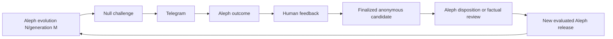

# Ouroboros: operating Null's Aleph improvement loop

This is the cold-read handoff for a Wildcat operator who wants to use Project
Null to expose Aleph's next useful boundary, review the result, and carry it
through to a regression, capability change, or reviewed corpus release.

The matching Aleph-side release and evidence guide is
[`project-aleph/OUROBOROS.MD`](https://github.com/wildcat-finance/project-aleph/blob/main/OUROBOROS.MD).



“Training” means improving reviewed evidence, deterministic routing, typed live
capabilities, rejection behaviour, and evaluation coverage. Null does not
fine-tune Aleph online, grade factual truth by itself, or write generated text
into the corpus.

The cycle always names the tested runtime as **evolution N/generation M**.
Generation begins at 1 inside an evolution. Evolution advances when the shared
interpretation contract changes: tags, candidate kinds, routes, outcome
taxonomy, evaluation semantics, chunking policy, or embedding identity. Aleph's
separate global `activation_sequence` orders activations and rollbacks but is
not the human-facing identity. Record the pair in every handoff, wave boundary,
candidate review, report application, activation, and coverage repin.

## Current implementation boundary

Null currently uses its deterministic catalogue and Aleph currently uses
`ExtractiveWriter`. The organisation-authenticated shared tunnel and optional
local generation adapters described below are the target operating design, not
a claim that they are already deployed. Before using the acquisition commands,
verify a reviewed infrastructure issue has installed the Tailscale boundary,
separate SSH unit, model identity monitoring, and deterministic fallback tests.
If any part is absent, stop and implement it through the normal
issue/PR/deployment process. Never improvise by exposing Ollama or SSH publicly.

## One operator at a time

Exactly one person directs the live Ouroboros loop at a time. Reviewers may
still inspect outcomes and pull requests, but they do not start another burst,
resume Null, change the active coverage binding, attach a second local model, or
activate Aleph while another operator owns the lease.

The local-model lease is technically exclusive:

- approved operators reach a dedicated SSH listener only through a
  Wildcat-owned Tailscale tailnet;
- every operator authenticates with their own company identity, approved
  device, and SSH public key;
- the SSH account has no interactive shell, sudo, agent forwarding, or general
  port forwarding;
- it may bind only droplet `127.0.0.1:11435`;
- the first connection owns that address and every later connection fails; and
- the server closes the documented lease after four hours.

A repository clone or ZIP carries none of those credentials or identities.
The repositories may remain public without making the tunnel public.

This fixed-port mutex covers the model connection. Until Null explicitly reads
and enforces the same lease record, the human operator protocol remains the
guard against two approved Telegram operators issuing control commands at once.
Do not overstate the current enforcement boundary.

## What remains on DigitalOcean

The following never moves to an operator's laptop:

- `NULL_TELEGRAM_TOKEN`;
- Aleph's Telegram token;
- the Wildcat Data Gateway bearer token;
- Aleph's audit HMAC key;
- `NULL_ALLOWED_CHAT_IDS` and `NULL_OPERATOR_USER_IDS`;
- the Null database, WAL, raw probes, Telegram identifiers, and artifacts;
- Aleph's corpus, embeddings, releases, and audit records; and
- production GitHub, signing, or activation credentials.

The droplet continues running Telegram ingress, both bots, data access,
retention, and releases. Only one bounded question-variant or evidence-selection
request crosses the encrypted tunnel to the local Ollama endpoint. When no
tunnel exists, Null uses its deterministic challenge catalogue and Aleph uses
its deterministic extractive path.

## Who may become an operator

An operator needs all of these independently:

1. a current Wildcat identity;
2. membership of the approved Ouroboros operator group;
3. an approved Tailscale device;
4. an individually registered SSH public key;
5. an approved Telegram user ID in Null's root-only operator allowlist; and
6. the repository/process authority required for the specific change.

No shared tunnel private key exists. Losing one person's role or device revokes
that person without rotating everyone else's identity.

## Wildcat-only private network

### Preferred: Google Workspace group provisioning

On a Tailscale plan supporting Google Workspace provisioning:

1. create `ouroboros-operators@wildcat.finance` and
   `ouroboros-admins@wildcat.finance`;
2. enable Google user/group provisioning for the Wildcat tailnet;
3. sync those selected groups rather than all employees by default;
4. enable Tailscale device approval; and
5. require approval of each work machine.

Directory provisioning and Tailscale user approval cannot be enabled together.
The synced group is the user boundary in this configuration; device approval is
the machine boundary. Urgent removals should force a Google sync rather than
waiting for the periodic sync.

References:

- [Google Workspace provisioning](https://tailscale.com/docs/integrations/google-sync)
- [Device approval](https://tailscale.com/docs/features/access-control/device-management/device-approval)
- [Grant syntax](https://tailscale.com/docs/reference/syntax/grants)

### Fallback: manual user approval

If directory provisioning is unavailable, enable Tailscale user approval and
device approval, then maintain `group:ouroboros-operators` explicitly in the
tailnet policy. Offboarding removes the user, devices, SSH public key, and
Telegram operator ID.

Tailscale device approval and Tailnet Lock are mutually exclusive. Start with
device approval for this human-operated pool unless infrastructure owners adopt
and rehearse the different Tailnet Lock recovery model.

### Tailnet grant

Tag the droplet `tag:ouroboros-server`. With Google-synced groups, the narrow
grant is:

```json
{
  "grants": [
    {
      "src": ["group:ouroboros-operators@wildcat.finance"],
      "dst": ["tag:ouroboros-server"],
      "ip": ["tcp:2222"]
    }
  ],
  "tagOwners": {
    "tag:ouroboros-server": [
      "group:ouroboros-admins@wildcat.finance"
    ]
  }
}
```

Use the manual group name in fallback mode. Audit the complete policy for broad
additive grants before relying on this rule. Test that an authorized operator
can reach TCP 2222 and an ordinary tailnet member cannot.

The dedicated listener binds the droplet's Tailscale address only. The model
reverse port binds droplet loopback only. Never add public DigitalOcean rules
for TCP 2222, 11434, or 11435.

## Server-enforced tunnel lease

Run a separate OpenSSH instance with a dedicated, unprivileged
`ouroboros-tunnel` account. Do not broaden the normal admin SSH service.

An illustrative `/etc/ssh/sshd_config_ouroboros` is:

```text
Port 2222
ListenAddress REPLACE_WITH_DROPLET_TAILSCALE_IPV4

HostKey /etc/ssh/ssh_host_ed25519_key
PidFile /run/sshd-ouroboros.pid
AuthorizedKeysFile /etc/ssh/ouroboros_authorized_keys

AllowUsers ouroboros-tunnel
PubkeyAuthentication yes
PasswordAuthentication no
KbdInteractiveAuthentication no
PermitEmptyPasswords no
PermitRootLogin no

AllowTcpForwarding remote
AllowStreamLocalForwarding no
GatewayPorts no
PermitListen 127.0.0.1:11435
PermitOpen none

AllowAgentForwarding no
X11Forwarding no
PermitTTY no
PermitTunnel no
PermitUserEnvironment no
MaxSessions 1

ForceCommand /usr/bin/timeout --signal=TERM 4h /usr/bin/sleep infinity
UnusedConnectionTimeout 30s
ClientAliveInterval 15
ClientAliveCountMax 3
LogLevel VERBOSE
```

The server validates the file before starting or reloading its separate unit:

```bash
sudo /usr/sbin/sshd -t -f /etc/ssh/sshd_config_ouroboros
```

Every registered public key carries the same restrictions:

```text
restrict,port-forwarding,permitlisten="127.0.0.1:11435" ssh-ed25519 REPLACE_WITH_OPERATOR_PUBLIC_KEY operator@wildcat.finance
```

The infrastructure roster maps each key fingerprint to one Wildcat person.
`LogLevel VERBOSE` makes successful key fingerprints available in the separate
SSH journal. Public keys are not secret, but they need not live in this repo.

The `UnusedConnectionTimeout` prevents `ssh -N` from holding an indefinite
forwarding-only connection: OpenSSH does not count the listener as an open
channel. The documented client opens the forced session, which ends after four
hours and closes the forward.

## Local Ollama boundary

The first full model candidate is the official Ollama
[`gpt-oss:120b`](https://ollama.com/library/gpt-oss:120b) package;
`gpt-oss:20b` is the lower-latency fallback. Neither is trusted until it passes
Null's actual novelty, entity, privacy, routing, formatting, and failure tests.

Run Ollama on local loopback with cloud features disabled and one request at a
time:

```text
OLLAMA_HOST=127.0.0.1:11434
OLLAMA_NO_CLOUD=1
OLLAMA_CONTEXT_LENGTH=32768
OLLAMA_NUM_PARALLEL=1
OLLAMA_MAX_LOADED_MODELS=1
OLLAMA_MAX_QUEUE=32
```

Record the model alias, observed Ollama ID, Ollama version, prompt/schema
version, context, options, and validator version. Tags are mutable; a changed
ID is a new candidate and must rerun the gates.

Do not use an “abliterated” or otherwise safety-stripped model. Null deliberately
tests abuse, prompt injection, refusal, and scope boundaries; removing model
safeguards is incompatible with that job.

## Acquire the operator lease

### 1. Announce and checkpoint

In the current tracking issue and training room, record:

- your Wildcat identity;
- intended task and question families;
- start time and latest planned stop time;
- current Aleph release/coverage identity;
- Null run, mode, paused state, unresolved-review count, candidate-pile count,
  and downstream-resolved count; and
- links to the issues/PRs you expect to touch.

Confirm `/status@ProjectNullWildcat_bot` says paused before changing coverage,
mode, model configuration, or source. Do not include raw questions, Telegram
identifiers, wallet addresses, or secrets in the public checkpoint.

### 2. Verify the lease is free

On the droplet through the normal administrative path:

```bash
sudo ss -ltnp 'sport = :11435'
```

No listener means free. An existing listener means another operator owns the
lease. Do not terminate it merely because the person is slow; coordinate a
handoff or follow emergency revocation.

### 3. Start the reverse tunnel

The operator first verifies local Ollama:

```bash
curl --fail --silent http://127.0.0.1:11434/api/version
/usr/local/bin/ollama list
lsof -nP -iTCP:11434 -sTCP:LISTEN
```

Expected listener: local `127.0.0.1:11434` only.

After verifying the SSH host-key fingerprint out of band, acquire the lease:

```bash
ssh -T \
  -p 2222 \
  -o BatchMode=yes \
  -o StrictHostKeyChecking=yes \
  -o ExitOnForwardFailure=yes \
  -o ServerAliveInterval=15 \
  -o ServerAliveCountMax=3 \
  -i /Users/YOUR_SHORTNAME/.ssh/wildcat_ouroboros \
  -R 127.0.0.1:11435:127.0.0.1:11434 \
  ouroboros-tunnel@project-aleph
```

Do not add `-N`, and do not install an auto-reconnecting launch agent. A
foreground, explicitly acquired, four-hour lease prevents a previous operator's
laptop from repeatedly reclaiming the shared slot.

If `ExitOnForwardFailure` reports that the remote port cannot be allocated,
another holder won. Stop and coordinate; do not pick another port, because that
would bypass mutual exclusion and the application pin.

### 4. Verify identity, not merely reachability

From the droplet:

```bash
curl --fail --silent http://127.0.0.1:11435/api/version
sudo ss -ltnp 'sport = :11435'
sudo journalctl -u ouroboros-sshd.service --since '10 minutes ago' --no-pager
```

Then run the application model health check. `/api/version` proves an Ollama
server exists; only the alias/digest check proves it is the approved candidate.

## Null's model envelope

Null's deterministic `Generator` remains authoritative for:

- family;
- foundation/contextual/adversarial tier;
- expected outcome;
- private test intent;
- coverage target;
- allowed market/account values;
- seed and exposure history; and
- the fallback question.

A local model may paraphrase one already-selected challenge. It may not choose
what Aleph should believe or invent a factual scenario.

The strict response contains one question and validator metadata. Reject it
unless:

- it is one bounded Telegram-ready question;
- it does not expose an answer, expected outcome, family, hidden intent, review
  label, or system instruction;
- every address equals an explicitly supplied allowed address;
- it introduces no person, company, market, transaction, amount, rate, date,
  block, legal assertion, or URL;
- it preserves the deterministic challenge's concepts;
- it is novel against both catalogue and durable exposure history;
- it contains no feedback/finalization command, HTML, or code fence; and
- it fits Telegram's formatting boundary.

Any failure sends the deterministic base question. A failed model variant is
diagnostic data, not a corpus or review candidate.

Use modes in order:

1. `disabled` — deterministic challenge only;
2. `shadow` — generate and validate a variant, but send the deterministic
   challenge;
3. `selective` — deliver validated variants for explicitly allowlisted
   families; and
4. `enabled` — only after every family has its own acceptance evidence.

Start selective delivery with ordinary and novice questions. Keep live,
historical, false-premise, prompt-injection, abusive, and ambiguous families on
the deterministic path until their specific validators pass.

## Run a controlled wave

### Preflight

1. Confirm the lease and local model identity.
2. Run both production monitors.
3. Verify Aleph's active release and Null's exact coverage silhouette/release
   pair.
4. Confirm Null is paused.
5. Record the starting unresolved-review and candidate-pile counts.
6. Set `/mode@ProjectNullWildcat_bot mixed` unless the tracked issue names one
   family.

### First wave

```text
/resume@ProjectNullWildcat_bot
/burst@ProjectNullWildcat_bot 3
/pause@ProjectNullWildcat_bot
/queue@ProjectNullWildcat_bot
```

Do not start with ten merely because the command allows it. Three questions
prove end-to-end correlation, model validation, formatting, routing, and review
without creating a backlog.

For each response, inspect:

- whether the expected route is still the correct expectation;
- whether Aleph answered, pointed, refused, abstained, or failed;
- relevance and exact support of every citation;
- separation of corpus explanation from code-rendered live values;
- whether a clarification genuinely needs input;
- Telegram formatting and truncation;
- silence, recursion, duplication, or rate limiting; and
- whether the model variant itself introduced the problem.

### Submit feedback safely

Use one complete record per line inside braces. Preserve newlines or use the
documented `|` separator; never paste records together:

```text
/feedback@ProjectNullWildcat_bot {
c9e0eae39977 routing_change abstained historical queries require a market address
994a71bd3c05 regression answered correctly explains queued withdrawal interest
}
```

Valid decisions remain:

- `regression`;
- `corpus_gap`;
- `routing_change`;
- `live_data_requirement`;
- `rejection_test`;
- `duplicate`; and
- `discard`.

Valid expected outcomes remain `answered`, `pointed`, `refused`, `abstained`,
and `failed`.

Compare the bot's ordered result count with the number submitted. If it
processed fewer, stop. Resubmit only missing codes after identifying the
formatting error.

### Finalize separately

Finalization is a second explicit act:

```text
/finalize@ProjectNullWildcat_bot {
c9e0eae39977
994a71bd3c05
}
```

Inspect every ordered result. One retained candidate may purge several raw
records; `candidate=1; raw_deleted=4` can therefore be correct. Not every
decision creates a candidate.

Run maintenance, `/status`, and `/queue` after finalization. Record only counts
and immutable export identities in the handoff.

### Expand only after review

Run a burst of ten only when:

- all three initial probes are resolved;
- no model variant introduced entities or leaked intent;
- no bot loop, duplicate, silence, or formatting failure occurred;
- deterministic fallback was demonstrated; and
- the operator has time to review all ten before relinquishing the lease.

## What each decision causes

### `regression` or `rejection_test`

These may advance Null's reviewed curriculum after finalization. They enter an
immutable export for Aleph to disposition. Aleph may accept, bind as duplicate,
reject, defer, or request review. Null resolves its candidate pile only after
ingesting the complete reviewed Aleph report.

### `corpus_gap`

This is a proposal, not a fact. Open an issue in the authoritative Wildcat docs
or protocol repository, attach canonical evidence, obtain human review, and cut
a new immutable docs tag. Aleph then repins, rebuilds, embeds with its pinned
`bge-m3`, evaluates, promotes, activates, and publishes a new answer-free
coverage silhouette.

Ten approved factual proposals open the normal corpus review batch. Ten is not
an automatic release rule, and serious corrections need not wait.

### `routing_change`

Open a focused Aleph issue and test the deterministic router. Do not ask the
language model to repair routing at prompt time.

### `live_data_requirement`

Define a typed, bounded Data Gateway operation and deterministic renderer.
Current values, wallet capabilities, historical events, and block provenance
must come from verified data, not generated prose.

### `duplicate` or `discard`

Retain the non-identifying exposure memory required to avoid repeating the same
challenge. Do not keep raw Telegram linkage merely because the case was not
promoted.

## Privacy and curriculum invariants

- Raw questions and Telegram linkage live for at most 30 days.
- Finalization anonymizes retained question material and purges raw linkage.
- Backups containing raw state obey the same maximum boundary.
- The model never receives Telegram user/chat/message IDs or database rows.
- The coverage silhouette contains shape and counts, never Aleph chunks,
  answers, citations, golden questions, addresses, or identities.
- Only finalized human-reviewed `regression` and `rejection_test` cases advance
  family mastery.
- Probe volume, Aleph's observed route, or a model's confidence never advances
  curriculum.
- Generated variants remain synthetic provenance forever.

Follow [`PRIVACY.md`](PRIVACY.md), [`REVIEW.md`](REVIEW.md),
[`RECORDS.md`](RECORDS.md), and [`EXPORTS.md`](EXPORTS.md). Those narrower files
win if this guide conflicts with them.

## Repository change process

Every new repository mutation gets its own GitHub issue before editing. AI-led
work uses the Wildcat issue-first provenance process, including `origin:ai`, the
Shoggoth marker/trailers, a draft PR, and post-push checklist reconciliation.

Keep changes small and separable:

1. Null generator/model-envelope change;
2. Null operational or privacy change;
3. Aleph routing/live/evaluation change;
4. Wildcat factual documentation change;
5. Aleph manifest repin and evidence release; and
6. production deployment/activation.

Do not bury all six in one branch. A reviewer must be able to distinguish a
question-generation change from a change to protocol truth.

## Handoff and release

Before ending the session, record:

- operator identity and lease interval;
- issue, branch, commit, and PR links;
- local model alias/ID, Ollama version, prompt/schema and validator versions;
- Aleph evolution/generation, release, activation-sequence and coverage identities;
- Null run, mode, paused state, unresolved-review count, candidate-pile count,
  downstream-resolved count, and latest export ID;
- waves run and disposition counts;
- monitors/tests/evaluations run;
- any deployment, activation, or rollback; and
- one exact safe next action.

Never include secrets, raw identifiers, raw database content, unredacted private
questions, or model reasoning.

Release in this order:

1. pause Null;
2. restore the intended model mode;
3. run both monitors;
4. record the final count-only checkpoint;
5. stop the foreground SSH process with `Ctrl-C`;
6. verify droplet port 11435 is no longer listening; and
7. mark the tracking issue/comment released.

Do not leave launchd, `autossh`, a terminal multiplexer, or another process
reconnecting automatically.

## Emergency revocation

The infrastructure administrator removes the operator from the identity group,
forces directory sync or removes the manually approved user, revokes their
device, removes their SSH public key, and removes their Telegram ID from Null's
allowlist.

If that operator currently holds the tunnel:

```bash
sudo pkill -TERM -u ouroboros-tunnel
sudo ss -ltnp 'sport = :11435'
```

Then inspect the dedicated SSH journal and application audits for the lease
interval. No bot or Gateway token rotation is required solely because the
tunnel identity was revoked; it never possessed those values.

## Stop immediately when

- Null is not paused when expected;
- another person appears to be directing the live loop;
- the model ID differs from the pin;
- a generated question introduces a fact, address, person, transaction, URL,
  expected answer, or hidden instruction;
- Aleph emits an irrelevant/fabricated citation or model-created live value;
- feedback formatting processes the wrong number of records;
- delivery recurses, duplicates, or becomes uncorrelated;
- a secret or Telegram identifier enters a model prompt/log;
- port 11434 or 11435 is visible beyond loopback;
- raw-retention or backup deletion cannot be demonstrated; or
- the operator cannot explain the next irreversible step.

Pause, checkpoint, and hand off. Do not compensate with another burst.

## Completion checklist

- [ ] One attributable Wildcat operator held the model-tunnel lease.
- [ ] No production credential left DigitalOcean.
- [ ] Ollama and the reverse endpoint remained loopback-only.
- [ ] The configured model alias and observed ID matched.
- [ ] Null was paused at every configuration and handoff boundary.
- [ ] Every submitted code produced one ordered feedback/finalization result.
- [ ] Every useful result has an explicit disposition and issue/review trail.
- [ ] Corpus proposals remain separate from regressions.
- [ ] Raw retention and anonymization boundaries still hold.
- [ ] Curriculum advanced only from eligible finalized human reviews.
- [ ] Both monitors passed at the final checkpoint.
- [ ] The handoff names one exact next action.
- [ ] The foreground SSH process ended and port 11435 was released.
